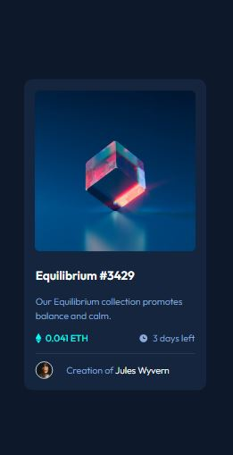
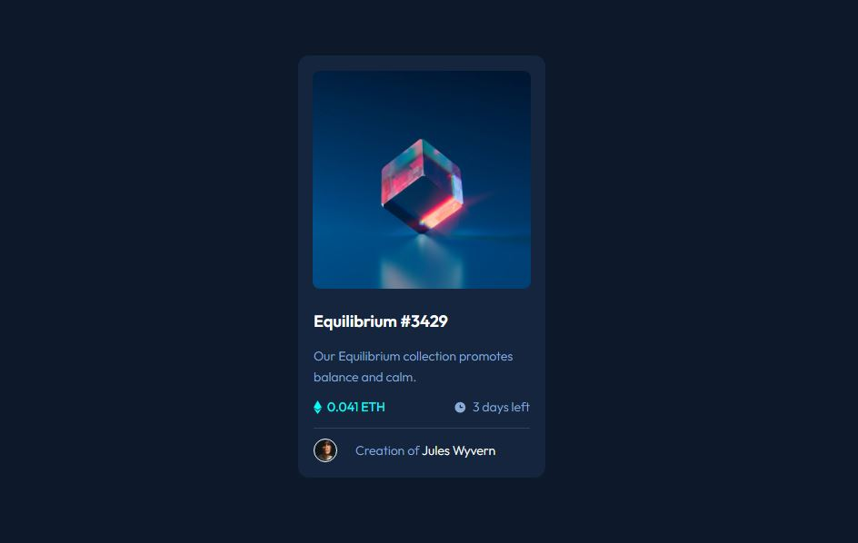

# Frontend Mentor - NFT preview card component solution

This is a solution to the [NFT preview card component challenge on Frontend Mentor](https://www.frontendmentor.io/challenges/nft-preview-card-component-SbdUL_w0U). Frontend Mentor challenges help you improve your coding skills by building realistic projects. 

## Table of contents

- [Overview](#overview)
  - [The challenge](#the-challenge)
  - [Screenshot](#screenshot)
  - [Links](#links)
- [My process](#my-process)
  - [Built with](#built-with)
  - [What I learned](#what-i-learned)
  - [Continued development](#continued-development)
- [Author](#author)

## Overview
A frontend-mentor challenge on NFT preview card component solution, Which involve building an interface for an NFT card, making it responsive and interactive
### The challenge

Users should be able to:

- View the optimal layout depending on their device's screen size
- See hover states for interactive elements

### Screenshot





### Links

- Solution URL: [Add solution URL here](https://your-solution-url.com)
- Live Site URL: [Add live site URL here](https://your-live-site-url.com)

## My process

### Built with

- Semantic HTML5 markup
- CSS custom properties
- Flex-box
- CSS Grid
- Mobile-first workflow

### What I learned

To see how you can add code snippets, see below:

```css
#overlay {
    position:absolute;
    width: 100%;
    height: 96%;
    z-index: 10;
    border-radius: 8px;
    
}
#overlay:hover{
    opacity:0.5;
     background-color: hsl(178, 100%, 50%);
    cursor: pointer;
    
}
```

### Continued development

- Css position
- Correct unit to use for font, width, margin , padding.
- Mobile responsiveness 

## Author

- Website - [Add your name here](https://www.your-site.com)
- Frontend Mentor - [@TRIPLE-ADE](https://www.frontendmentor.io/profile/TRIPLE-ADE)
- Twitter - [@Triple123A](https://www.twitter.com/Triple123A)
